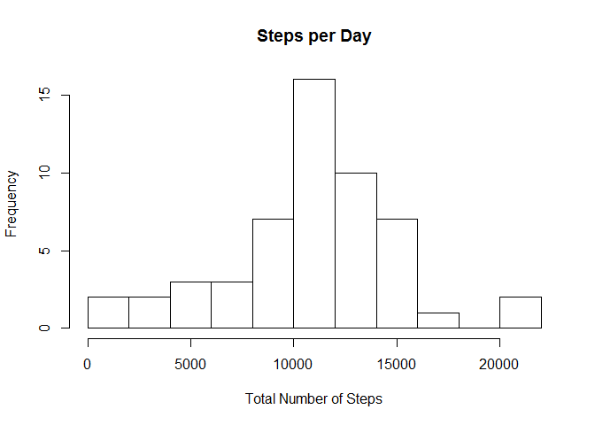
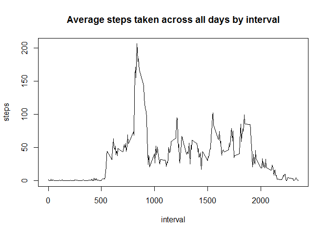
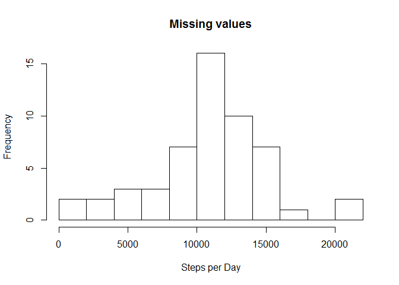
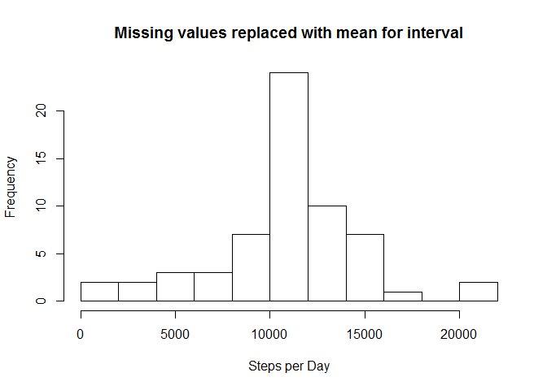
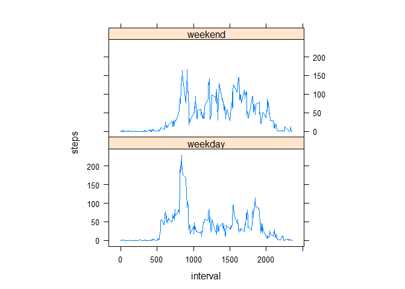

# Reproducible Research: Peer Assessment 1

## Introduction

This assignment makes use of data from a personal activity monitoring device. This device collects data at 5 minute intervals through out the day. The data consists of two months of data from an anonymous individual collected during the months of October and November, 2012 and include the number of steps taken in 5 minute intervals each day.

The variables included in this dataset are:

- **steps:** Number of steps taking in a 5-minute interval (missing values are coded as NA)

- **date:** The date on which the measurement was taken in YYYY-MM-DD format

- **interval:** Identifier for the 5-minute interval in which measurement was taken

The dataset is stored in a comma-separated-value (CSV) file and there are a total of 17,568 observations in this dataset.


## Loading and preprocessing the data

For our calculations, we'll load the activity data from the extracted activity.csv file into a data frame.  I've loaded the dplyr library which will be used later on.


```r
activityData = read.csv('activity.csv', header=TRUE)

# load the library dplyr
library(dplyr)
```

```
## 
## Attaching package: 'dplyr'
## 
## The following objects are masked from 'package:stats':
## 
##     filter, lag
## 
## The following objects are masked from 'package:base':
## 
##     intersect, setdiff, setequal, union
```


## What is mean total number of steps taken per day?

First, we'll summarize the total number of steps taken per day.

```r
stepsPerDay <-aggregate(steps~date, data=activityData, sum, na.rm=TRUE)
```


From this summarization we'll create a histogram of the total number of steps taken each day.

```r
hist(stepsPerDay$steps, breaks=10, xlab='Total Number of Steps', main='Steps per Day')
```

 


The mean and median of the total number of steps taken per day is as follows.

```r
mean(stepsPerDay$steps)
```

```
## [1] 10766.19
```

```r
median(stepsPerDay$steps)
```

```
## [1] 10765
```


## What is the average daily activity pattern?
The following is a time series plot (i.e. type = "l") of the 5-minute interval (x-axis) and the average number of steps taken, averaged across all days (y-axis)

```r
stepsPerInterval <-aggregate(steps ~ interval, data = activityData, mean, na.rm = TRUE)

plot(steps ~ interval, data = stepsPerInterval, type = "l", main = "Average steps taken across all days by interval")
```

 

Which 5-minute interval, on average across all the days in the dataset, contains the maximum number of steps?

```r
stepsPerInterval[which.max(stepsPerInterval$steps), ]$interval
```

```
## [1] 835
```
The 5-minute interval with the maximum number of steps is **835**.

## Imputing missing values

There are a number of days/intervals where there are missing values (coded as NA). The presence of missing days may introduce bias into some calculations or summaries of the data.

1. Calculate and report the total number of missing values in the dataset

```r
sum(is.na(activityData$steps))     
```

```
## [1] 2304
```
The total number of rows with NAs is **2304**.

2. Devise a strategy for filling in all of the missing values in the dataset. The strategy does not need to be sophisticated. For example, you could use the mean/median for that day, or the mean for that 5-minute interval, etc.


*I used a strategy to take the mean for the 5-minute interval and place the result into the matching empty record*


3. Create a new dataset that is equal to the original dataset but with the missing data filled in.

```r
# create a new data frame with the mean for each interval
intervalMean <- aggregate(steps~interval, data=activityData, FUN=mean, na.rm=TRUE)
intervalMean$steps <-as.integer(intervalMean$steps)

# perform a left join and place the results in activityDataNAsFilled
activityDataNAsFilled <- left_join(activityData,intervalMean, by="interval")

# create function that will return the second value if the first value is NA
replaceNAs = function(x,y){
                              if (is.na(x)){
                              return(y)
                              }
                              return(x)
                          }

# copy over the mean values for records with NAs
activityDataNAsFilled$steps.x = mapply(replaceNAs,activityDataNAsFilled$steps.x, activityDataNAsFilled$steps.y)

# drop the extra column and rename the original steps column
activityDataNAsFilled$steps.y <-NULL
names(activityDataNAsFilled)[names(activityDataNAsFilled)=="steps.x"] <-"steps"
```


4. Make a histogram of the total number of steps taken each day and Calculate and report the mean and median total number of steps taken per day. Do these values differ from the estimates from the first part of the assignment? What is the impact of imputing missing data on the estimates of the total daily number of steps?\

*From the resulting histograms it does not appear that imputing missing data has a significant impact on the analysis.*


```r
hist(stepsPerDay$steps, 
          breaks=10, 
          xlab='Steps per Day',
          main='Missing values'
     )
```

 

```r
mean(stepsPerDay$steps)
```

```
## [1] 10766.19
```

```r
median(stepsPerDay$steps)
```

```
## [1] 10765
```


```r
mergedStepsPerDay <-aggregate(steps~date, 
                        data=activityDataNAsFilled, 
                        sum, 
                        na.rm=TRUE
                        )


hist(mergedStepsPerDay$steps, 
          breaks=10, 
          xlab='Steps per Day',
          main='Missing values replaced with mean for interval'
     )
```

 

```r
mean(mergedStepsPerDay$steps)
```

```
## [1] 10749.77
```

```r
median(mergedStepsPerDay$steps)
```

```
## [1] 10641
```


## Are there differences in activity patterns between weekdays and weekends?
For this part the weekdays() function may be of some help here. Use the dataset with the filled-in missing values for this part.

1. Create a new factor variable in the dataset with two levels - "weekday" and "weekend" indicating whether a given date is a weekday or weekend day.

```r
activityDataNAsFilled$day = ifelse(as.POSIXlt(as.Date(activityDataNAsFilled$date))$wday%%6==0,"weekend","weekday")

activityDataNAsFilled$day=factor(activityDataNAsFilled$day,levels=c("weekday","weekend"))
```


2. Make a panel plot containing a time series plot (i.e. type = "l") of the 5-minute interval (x-axis) and the average number of steps taken, averaged across all weekday days or weekend days (y-axis). See the README file in the GitHub repository to see an example of what this plot should look like using simulated data.


```r
stepsByDayandWeekpart=aggregate(steps~interval + day , activityDataNAsFilled, mean)

library(lattice)

xyplot(steps ~ interval | factor(day),
       data = stepsByDayandWeekpart,
       aspect = 1/2,
       type = "l")
```

 

